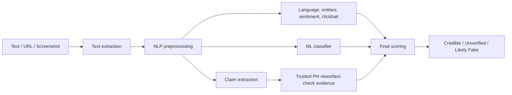

<p align="center">
  
</p>
<p align="center">
  <em>NLP-assisted fake news and claim credibility detection for Philippine social media.</em>
</p>
<p align="center">
  
  
  
  
  
</p>
<p align="center">
  <a href="https://philverify.web.app"><strong>🌐 Live Demo</strong></a> &nbsp;•&nbsp;
  <a href="https://semiautomat1c-philverify-api.hf.space/docs"><strong>📖 API Docs</strong></a>
</p>

---

## ✨ Features

- **📝 Text Verification** — Analyze pasted claims, headlines, and social media posts
- **🔗 URL Verification** — Extract article/post text and check credibility against evidence
- **🖼️ Image OCR** — Extract and analyze text from screenshots and images (Tesseract fil+eng)
- **🇵🇭 Language-Aware** — Handles Tagalog, English, and Taglish content
- **🧠 NLP Pipeline** — Preprocessing, language detection, entity extraction, sentiment/clickbait signals, and claim extraction
- **⚖️ Two-Layer Scoring** — Combines ML classification with trusted Philippine news/fact-check evidence retrieval
- **🛡️ PH-Domain Verification** — Integrated database of Philippine news domain credibility tiers

The public demo is intentionally scoped to text, URLs, and image/screenshot OCR. A legacy backend video route may remain available internally, but it is not part of the final project scope.

---

## Dataset and Evaluation Plan

| Dataset / Source | Role | Labels | Notes |
|------------------|------|--------|-------|
| `jcblaise/fake_news_filipino` | Main training source | Real / Fake mapped to `Credible` / `Likely Fake` | Filipino fake-news benchmark dataset |
| `philverify_handcrafted` | Training supplement | `Credible`, `Unverified`, `Likely Fake` | Adds Tagalog/Taglish examples and more `Unverified` claims |
| Rappler and VERA Files samples | Training supplement and evidence examples | Fact-check verdicts mapped to 3 labels | Used carefully; evidence matching matters more than source name |
| `ml/data/eval/facebook_style_claims.csv` | Separate evaluation set | `Credible`, `Unverified`, `Likely Fake` | 60 Facebook-style claims kept out of training |
| Trusted PH news domains | Evidence layer | Not direct labels | Rappler, ABS-CBN, GMA, Inquirer, PhilStar, PNA, VERA Files, and official agencies |

Run the two evaluation passes separately:

```bash
cd PhilVerify
python -m ml.eval --skip-lda-analysis
python -m ml.eval_facebook_style --skip-lda
```

The first command reports validation performance on the processed training dataset split. The second command reports how the classifier behaves on short, informal Facebook-style claims.

---

## System Flow



PhilVerify predicts credibility. It does not guarantee absolute truth.

---

## 🚀 Deployment

| Service | Platform | URL |
|---------|----------|-----|
| **Frontend** | Firebase Hosting | https://philverify.web.app |
| **Backend API** | Hugging Face Spaces (Docker) | https://semiautomat1c-philverify-api.hf.space |
| **API Docs** | Swagger UI (auto-generated) | https://semiautomat1c-philverify-api.hf.space/docs |

---

## 🖥️ Local Development

### Prerequisites

1. **Python 3.12+**
2. **Tesseract OCR** — `brew install tesseract tesseract-lang`
3. **Node.js 18+** (for frontend)

### Installation

```bash
# Clone the repository
git clone https://github.com/SemiAutomat1c/philverify.git
cd philverify

# Set up backend
python3 -m venv venv
source venv/bin/activate
pip install -r requirements.txt

# Set up frontend
cd frontend
npm install
```

### Run

```bash
# Backend (from project root, with venv active)
uvicorn main:app --reload --port 8000

# Frontend (in a separate terminal)
cd frontend
npm run dev
```

The frontend dev server proxies `/api` requests to `http://localhost:8000` automatically.

### Environment Variables

Copy `.env.example` to `.env` and fill in your keys:

```
NEWS_API_KEY=your_newsapi_key
FIREBASE_PROJECT_ID=your_project_id
```

For frontend production builds, set `VITE_API_BASE_URL` in `frontend/.env.production`:
```
VITE_API_BASE_URL=https://your-hf-space.hf.space/api
```

---

## 🛠️ Tech Stack

| Component | Technology |
|-----------|------------|
| **Core Backend** | Python 3.12, FastAPI, Pydantic v2 |
| **NLP Engine** | spaCy, HuggingFace Transformers, langdetect |
| **ML Classification** | scikit-learn (TF-IDF + Logistic Regression) |
| **OCR** | Tesseract (fil+eng), pytesseract, Pillow |
| **Frontend** | React 18, TailwindCSS, Chart.js, Vite 7 |
| **Backend Hosting** | Hugging Face Spaces (Docker SDK, port 7860) |
| **Frontend Hosting** | Firebase Hosting |

---

## 📁 Project Structure

```
PhilVerify/
├── main.py                  # FastAPI app entry point + health endpoints
├── config.py                # Settings (pydantic-settings)
├── requirements.txt
├── Dockerfile               # Docker image for HF Spaces (port 7860)
├── domain_credibility.json  # PH news domain credibility tier database
│
├── api/
│   ├── schemas.py           # Pydantic request/response models
│   └── routes/
│       ├── verify.py        # POST /api/verify — handles text/url/image
│       ├── history.py       # GET /api/history
│       └── trends.py        # GET /api/trends
│
├── nlp/                     # NLP preprocessing pipeline
│   ├── preprocessor.py      # Clean, tokenize, remove stopwords (EN+TL)
│   ├── language_detector.py # Tagalog / English / Taglish detection
│   ├── ner.py               # Named entity recognition + PH entity hints
│   ├── sentiment.py         # Sentiment + emotion analysis
│   ├── clickbait.py         # Clickbait pattern detection
│   └── claim_extractor.py   # Extract falsifiable claim for evidence search
│
├── ml/
│   └── tfidf_classifier.py  # Layer 1 — TF-IDF baseline classifier
│
├── evidence/
│   └── news_fetcher.py      # Layer 2 — NewsAPI + cosine similarity
│
├── scoring/
│   └── engine.py            # Orchestrates full pipeline + final score
│
├── inputs/
│   ├── url_scraper.py       # BeautifulSoup article extractor
│   └── ocr.py               # Tesseract OCR for images
│
├── frontend/                # React + Vite frontend
│   ├── src/
│   │   ├── pages/
│   │   │   └── VerifyPage.jsx   # Main fact-check UI (tabs, results, chips)
│   │   └── api.js               # API client (supports VITE_API_BASE_URL)
│   └── .env.production          # Production API base URL
│
└── tests/
    └── test_philverify.py   # Unit + integration tests
```

---

## 📅 Roadmap

- [x] Phase 1 — FastAPI backend skeleton
- [x] Phase 2 — NLP preprocessing pipeline
- [x] Phase 3 — TF-IDF baseline classifier
- [x] Phase 4 — NewsAPI evidence retrieval
- [x] Phase 5 — React web dashboard with text, URL, and screenshot input
- [x] Phase 6 — Deploy to Hugging Face Spaces (backend) + Firebase (frontend)
- [x] Phase 7 — Facebook-style evaluation dataset
- [ ] Phase 8 — Scoring engine refinement (stance detection)
- [ ] Phase 9 — Chrome Extension polish (Manifest V3)
- [ ] Phase 10 — Fine-tune XLM-RoBERTa / TLUnified-RoBERTa

---

## Limitations

- Facebook posts are shorter and more informal than many news-article training samples.
- Screenshot OCR can misread blurry, cropped, or stylized text.
- Satire, sarcasm, quote cards, and missing context remain difficult.
- `Unverified` is the hardest class because it represents uncertainty rather than a single writing style.
- Verdicts should be treated as research/educational credibility signals, not professional fact-check rulings.

---

## 🤝 Contributing

Contributions welcome! Please feel free to submit a Pull Request.

---

<p align="center">
  <strong>⚠️ Disclaimer</strong><br>
  <em>This tool is meant for research and educational purposes. Use responsibly and ethically when verifying information on social media.</em>
</p>

## 📝 License

MIT
